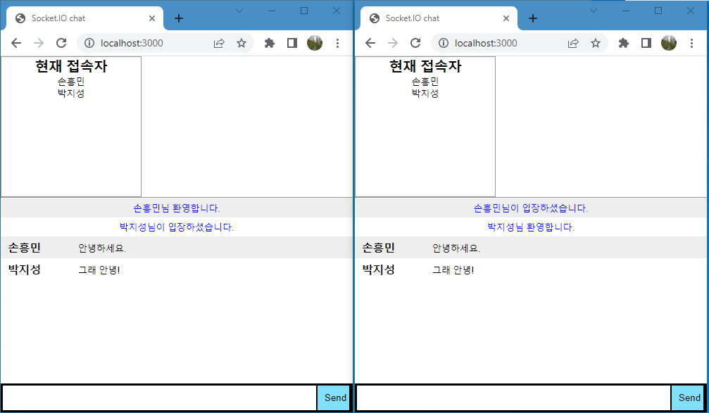

## node.js와 socket.io를 활용한 채팅 server/client 구현

### 채팅창 스크린샷

### 배운 내용

node.js와 socket.io를 활용하여 간단한 채팅 프로그램을 만들어보았습니다. 비록 js 코드가 익숙하지 않아서 교재를 보고 작성했지만, index.html 파일내에 스타일(css)과 html 코드는 물론 script 탭 안에 js 코드를 작성하여 모든것을 한 파일에 구현할 수 있었습니다.
